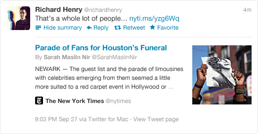
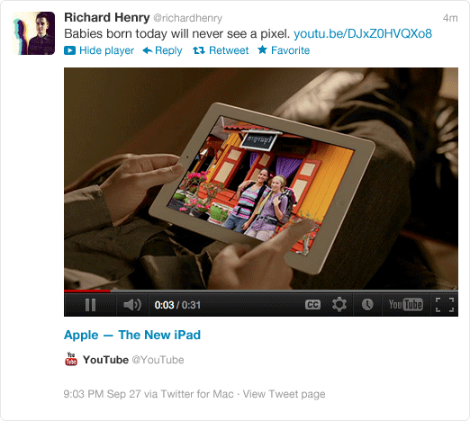
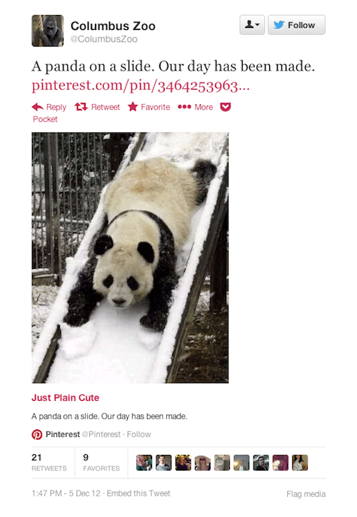

# Guidelines : HTML

*Bonnes pratiques HTML en production*

## Généralités

* L’encodage des fichiers et des bases de données doit se faire en UTF-8 (sans BOM).
* Les indentations se font à l’aide de deux espaces et non à l'aide de tabulations. Pour assurer une cohérence inter-projets, utiliser la convention [EditorConfig](http://editorconfig.org/).
* Les liens absolus ne doivent pas faire apparaître le protocole (par exemple href="//www.alsacreations.fr/" et non href="http://www.alsacreations.fr").
* Choisir des noms en anglais prioritairement (classes, fichiers, images, etc.).
* Séparer les noms des fichiers, des images des classes et id CSS par des tirets (`.slide-info`, `styles-ie.css`, `jquery-2.0.min.css`, etc), sauf convention contraire apportée par le client.
* Les noms d'éléments et des attributs sont rédigés en minuscules,
* Les éléments sont imbriqués correctement,
* Les éléments sont fermés à l'aide de la balise correspondante (exception pour éléments auto-fermants HTML5 : pas de `/>`),
* Les valeurs identiques aux attributs ne sont pas renseignées sauf nécessité (ex. en HTML5 pas de `checked="checked"`),
* L'usage des double quotes est préconisé autour des valeurs d’attributs (ex. `class="fruit"`) ainsi que les simples quotes dans les autres langages JavaScript, PHP (ex. `alert('blup');`) de manière à faciliter les imbrications (ex. `alert('<p class="fruit">plop</p>');`)

## Doctype

Par défaut, et sans contre-indication du client, un doctype HTML5 est choisi pour sa concision, sa pérennité et sa robustesse (pas de bugs ou manque de support connus des navigateurs):

```
<!doctype html>
```

## Langue

La langue de la page est systématiquement renseignée via un attribut dans l’élément `<html>`  :

```
<html lang="fr">
```

## Encodage

L’encodage du document (en UTF-8) est systématiquement renseigné via un élément meta dans le `<head>` :

```
<meta charset="UTF-8">
```

## Titre de la page

Le titre de page, différent à chaque page, est systématiquement renseigné via un élément `<title>` dans le `<head>` :

```
<title>J'aime la choucroute</title>
```

## Meta "Viewport"

Pour une adaptation du site web vers les terminaux mobiles, l’élément `<meta name="viewport">` est ajouté dans la partie `<head>`.

```
<meta name="viewport" content="width=device-width, initial-scale=1.0, shrink-to-fit=no">
```

**_Note : Les syntaxes empêchant l’agrandissement des contenus par le visiteur seront proscrites (maximum-scale=1, user-scalable=no, etc.)._**


Documentation : [http://www.alsacreations.com/article/lire/1490-comprendre-le-viewport-dans-le-web-mobile.html](http://www.alsacreations.com/article/lire/1490-comprendre-le-viewport-dans-le-web-mobile.html)

## Classes conditionnelles

Dans le cas de modifications à opérer pour les anciennes versions d'Internet Explorer, et si le document CSS se doit d'être validé par l'outil de validation du W3C, un nom de classe spécifique à l’élément `<html>` sera appliqué via un commentaire conditionnel et sans nécessiter d’appel vers une feuille de styles supplémentaire.

**_Note : par défaut, nous ne tenons plus compte des versions Internet Explorer inférieures à IE10, donc nous n’employons plus de classes conditionnelles._**

```
<!--[if lte IE 7]> <html class="ie67 ie678" lang="fr"> <![endif]-->
<!--[if IE 8]> <html class="ie8 ie678" lang="fr"> <![endif]-->
<!--[if IE 9]> <html class="ie9" lang="fr"> <![endif]-->
<!--[if gt IE 9]><!--> <html lang="fr"> <!--<![endif]-->
```

## HTML5shim / shiv

Pour IE6, IE7 et IE8, il est nécessaire de déclarer les éléments HTML5 dans le DOM en JavaScript pour pouvoir les styler.

**_Note :_ par défaut, nous ne tenons plus compte des versions Internet Explorer inférieures à IE10, donc nous n’employons plus HTML5shim._**

[HTML5shiv](http://code.google.com/p/html5shiv/) sera employé pour cette opération qui applique déjà des styles par défaut. À systématiquement placer dans la section `<head>`.

```
<!--[if lt IE 9]>
<script src="//html5shiv.googlecode.com/svn/trunk/html5.js"></script>
<![endif]-->
```

Si Modernizr est embarqué dans la page (pour bénéficier d’un support dédié à l’amélioration progressive pour les anciens navigateurs), ce script peut déjà inclure un équivalent HTML5shiv (si on l’ajoute lors de la composition de Modernizr).

## Forcer le mode de compatibilité IE

Pour forcer IE à passer dans le mode de compatibilité standard le plus récent, il est préconisé d’ajouter la `<meta>` suivante dans la section `<head>` :

```
<!--[if IE]>
<meta http-equiv="X-UA-Compatible" content="IE=edge">
<![endif]-->
```

## Favicon

L’icône de favori est utilisée de différentes manières par les navigateurs et systèmes. Le format ICO est ancien, le format PNG permet une meilleure définition avec un poids plus léger. Mais :

* IE ne reconnaît que la relation "shortcut icon" (standard : “icon”), ne reconnaît pas le format PNG, et la version 10 ne supporte plus les commentaires conditionnels (pour isoler sa déclaration non standard et le format ICO). IE (y compris 10) va tout de même chercher par défaut dans la racine `/favicon.ico`
* Tous les autres navigateurs reconnaissent le format PNG, mais Chrome et Safari choisissent le format ICO s’il est précisé plutôt que le PNG. Opera choisit au hasard.

Source : [http://realfavicongenerator.net/](http://realfavicongenerator.net/)

Source (variante) : [https://github.com/audreyr/favicon-cheat-sheet](https://github.com/audreyr/favicon-cheat-sheet)

Structure satisfaisante de favicon :

```
<link rel="apple-touch-icon-precomposed" href="path/to/favicon-152x152.png">
<link rel="icon" href="path/to/favicon-32.png" sizes="32x32">
<!--[if IE]><link rel="shortcut icon" href="path/to/favicon.ico"><![endif]-->
<!-- et utiliser /favicon.ico pour IE10 -->
<!-- Windows8 tuile Modern UI (facultatif et invalide HTML W3C) -->
<meta name="msapplication-TileColor" content="#D83434">
<meta name="msapplication-TileImage" content="path/to/favicon-144x144.png">
<!-- /Windows8 -->
```

## Sémantique globale

Les éléments HTML5 `<header>`, `<article>`, `<main>`, `<footer>`, `<aside>`, `<section>` et `<nav>` sont privilégiés aux éléments neutres `<div>` si leur fonction s’y prête.

**_Note : l’élément `<main>` n’est complètement reconnu qu’à partir de IE11_**

La structure globale préconisée est celle-ci :

* `<body>` : corps de page et du site web
* `<div id="wrapper">` : sous-conteneur optionnel. Par exemple si body ne suffit pas
* `<div class="inner">` : sous-conteneur optionnel. Par exemple pour centrer plusieurs blocs de la même manière
* `<main id="main" role="main">` : conteneur général du contenu
* `<header id="header" role="banner">` : entête global
* `<footer id="footer" role="contentinfo">` : pied de page global
* `<aside class="aside" role="complementary">` : barre latérale globale. Note : `<aside>` doit pouvoir être extrait de la page sans poser de problème, en clair ne pas y placer la navigation par exemple.
* `<nav id="navigation" role="navigation">` : navigation principale
* `<form id="search" role="search">` : recherche principale

## Liens d’évitement

Afin de proposer une navigation alternative au clavier pour certaines déficiences visuelles, des liens d’évitements sont systématiquement intégrés dans la structure HTML :

```
<div class="skip-links">
  <a href="#navigation">Aller au menu</a>
  <a href="#main">Aller au contenu</a>
  <a href="#search">Aller à la recherche</a>
</div>
```

Afin de rendre automatiquement visibles / audibles les liens d’évitement lors de la navigation au clavier via la touche Tab, nous employons par défaut ces règles de styles CSS :

```
.skip-links {
  position: absolute;
}
.skip-links a {
  position: absolute;
  left: -9999px;
  padding: 0.5em;
  background: #000;
  color:#fff;
  text-decoration: none;
}
.skip-links a:focus {
  position: static;
}
```

## Accessibilité

Une attention toute particulière sera apportée à l’accessibilité des documents afin que chaque utilisateur, quelle que soit sa défaillance, puisse avoir plein accès aux contenus proposés.

Documentation : [https://github.com/DISIC/guide-integrateur](https://github.com/DISIC/guide-integrateur)

## Microdata

Dans la mesure du possible, et selon le type de site, les microformats les plus courants seront ajoutés.

Vocabulaire privilégié : [http://schema.org](http://schema.org) (promu et utilisé par Google, Yahoo, Bing, Yandex).

Types : Events, Person, Product, Movie, Book, Recipe, et toute la [hiérarchie](http://schema.org/docs/full.html), avec les attributs HTML5.

Documentation : [http://www.alsacreations.com/article/lire/1509-microdata-microformats-schema-semantique.html](http://www.alsacreations.com/article/lire/1509-microdata-microformats-schema-semantique.html)

## États des éléments

Les éléments ayant une condition ou un état particulier seront préfixés :

* Le lien, l’onglet ou la page active est désigné par la classe `.is-current`
* tout état sera préfixé par "is-". Ex. `.is-paused`, `.is-opened`, `.is-hidden`, `.has-*`
* tout événement ou comportement JavaScript sera préfixé par "js-". Ex. `.js-nav-button`, `.js-menu`, `.js-is-hidden`

## Nombre de classes par élément

Pour des raisons évidentes de maintenance et de lisibilité, nous limitons le nombre de classes appliquées à un élément à 4 ou 5 au grand maximum, même si nous employons un framework CSS qui nous inciterait dépasser ce nombre.

Nous éviterons de telles syntaxes : `img class="mod clearfix fl inbl w200p pas mb1 large-mb2 small-mbn"`, mais opterons plutôt pour une classe personnalisée : `img class="media"`.

## Liens target _blank

Dans la mesure du possible, éviter les liens ouvrant une nouvelle fenêtre/onglet, sans les signaler explicitement. Ils perturbent la navigation classique du visiteur et peuvent créer des failles de sécurité.

Voir aussi [https://medium.com/@jitbit/target-blank-the-most-underestimated-vulnerability-ever-96e328301f4c](https://medium.com/@jitbit/target-blank-the-most-underestimated-vulnerability-ever-96e328301f4c)

**_Toujours utiliser `rel="noopener noreferrer"` sur des liens `target="_blank"`_**

## Meta spécifiques - SEO et réseaux sociaux

Les liens entre site web et les différents réseaux sociaux sont de plus en plus forts. Certaines meta spécifiques permettent de faciliter ou d’améliorer ces liens, sans que l’on connaisse directement leur impact sur le référencement direct.

#### Twitter card

Elle permet une présentation améliorée d’un site web sur le réseau Twitter et lien ce site web à un compte Twitter via son URL mentionnée dans un Tweet. Exemple :

## 

Exemple d’une carte de type *summary*

Le code correspondant pourrait ressembler à cela :

```
<meta name="twitter:card" content="summary">
<meta name="twitter:url" content="http://alsacreations.com/{content_url}">
<meta name="twitter:image" content="/default_square_icon.png">
<meta name="twitter:title" content="{page_title} – Alsacréations">
<meta name="twitter:description" content="Alsacréations, blog d'actualité dans le monde des technologies web (HTML5, CSS 3, JavaScript, etc.)">
<meta name="twitter:site" content="@alsacreations">
<meta name="twitter:creator" content="@diou">
```

* **Twitter:card** : "summary", “player” ou “photo” sont des valeurs possibles
* **Twitter:url** : l’URL canonique de la référence
* **Twitter:title** : Le titre de la carte (devrait correspondre au titre de la page de l’URL canonique)
* **Twitter:image** : l’URL de l’image illustrant la page
* **Twitter:site** : le compte Twitter associé au site web éditeur (publisher)
* **Twitter:creator** : le compte Twitter associé à l’auteur

Plus d’infos : [https://dev.twitter.com/cards/types/summary](https://dev.twitter.com/cards/types/summary)

Exemple d’une carte de type "photo" (la première) et “player” (la seconde) :



**_Note : l’utilisation de ces meta invalide le document s’il est de doctype HTML5. La valeur twitter:* n’est en effet pas reconnue pour la balise meta._**

Une fois en place, il faut demander la validation par Twitter : [https://dev.twitter.com/docs/cards/validation/validator](https://dev.twitter.com/docs/cards/validation/validator)

#### Facebook et OpenGraph

L’[OpenGraph](http://ogp.me/) permet, à l’instar de Twitter Cards, de maîtriser d’avantage les contenus partagés sur le réseaux social Facebook (entre autres). Le titre, l’image d’illustration, la description, l’URL, etc. peuvent être personnalisés pour ce réseaux spécifique.

Parmi les valeurs de og: les plus utilisées on retrouve :

```
<meta property="og:title" content="Alsacréations, agence Web exotique">
<meta property="og:url" content="http://alsacreations.fr">
<meta property="og:locale" content="fr_FR">
<meta property="og:site_name" content="Alsacréations.fr">
<meta property="og:description" content="Alsacréations est une agence Web exotique proposant à ses clients des solutions originales et professionnelles.">
<meta property="og:image" content="/default_square_icon.png">
<meta property="og:type" content="website">
```

Une balise meta spécifique à Facebook permet d’associer le site web à une application précise de Facebook.

```
<meta property="fb:app_id" content="250737731706431">
Afin de pouvoir utiliser ces meta spécifiques, un namespace xmlns doit être créé, ce qui rend invalide la page en HTML5 pur. La balise HTML devient alors :
<html lang="fr" xmlns:fb="http://www.facebook.com/2008/fbml" xmlns:og="http://opengraphprotocol.org/schema/">
```

#### OpenSearch

Si le projet comporte un moteur de recherche efficace et pertinent, il peut être doté d’[OpenSearch](http://www.opensearch.org/).
